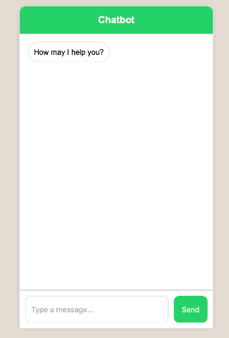

# chatbot
The purpose is to build an AI chatbot with Natural Language Processing in Python. The chatbot aims to make it easier for users to gather information by responding to questions through text input. It will be able to comprehend natural language input and process it to identify relevant info and respond to the user's queries. The project used NLP techniques such as tokenization and text recognition to improve their understanding of the query and respond effectively. 

## Get Started
```
pip install nltk
pip install flask
pip install gunicorn
gunicorn -w 4 -b 0.0.0.0:8000 app:app
http://127.0.0.1:8000
```

## DEMO
 
